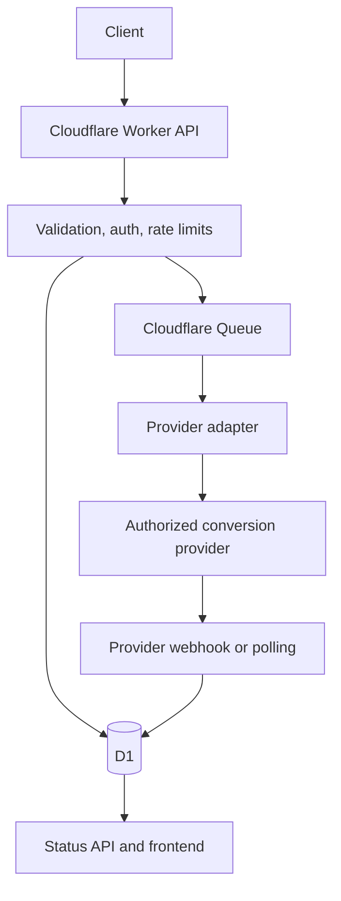
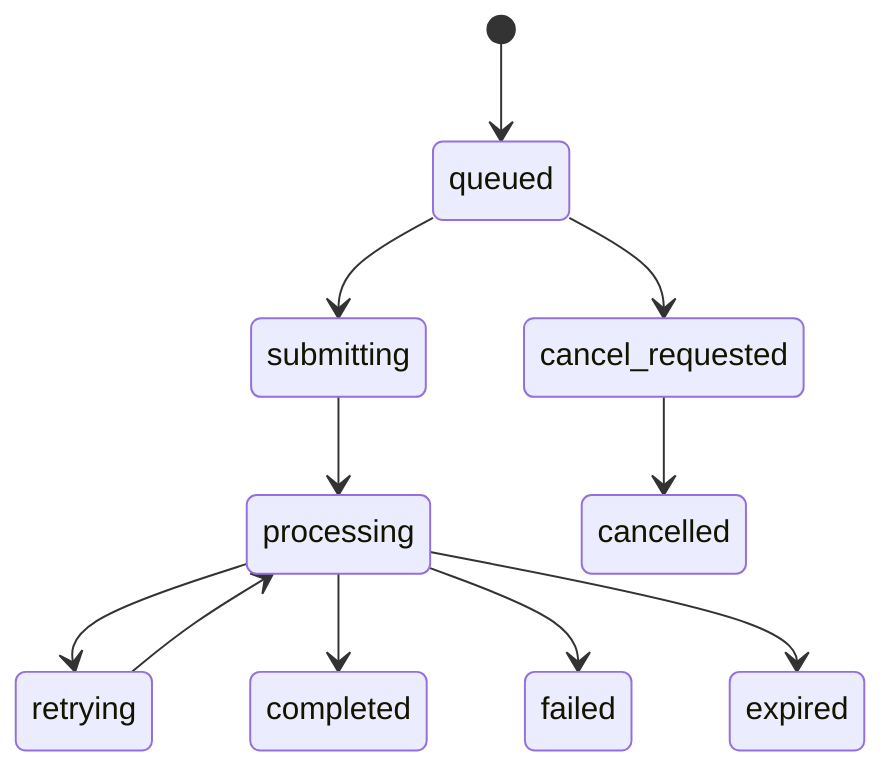
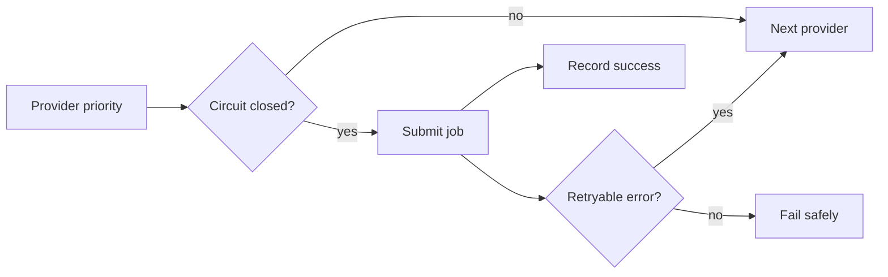
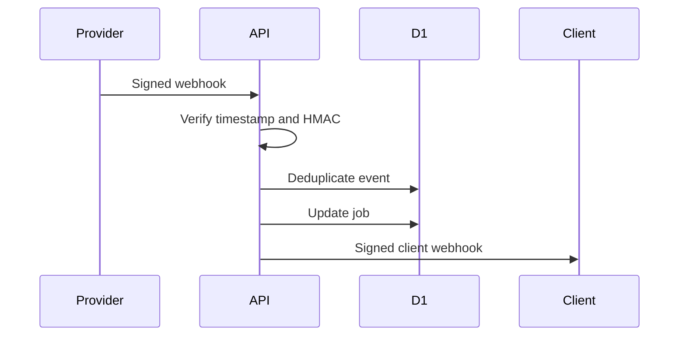

# EliteConverter

Convert Streams. Deliver Anywhere.

EliteConverter is a TypeScript monorepo for a Cloudflare Workers web platform and developer API. It accepts authorized M3U8 media URLs, validates them, creates asynchronous conversion jobs and delegates conversion to configured third-party providers. The Worker does not perform native video transcoding or buffer large video files.

Created by Siddhartha Abhimanyu

- Telegram: [@iflexsid](https://t.me/iflexsid)
- Instagram: [elite.sid](https://instagram.com/elite.sid)

## Current Feature Status

- Frontend: React, Vite, Tailwind CSS, React Router, TanStack Query, responsive light/dark/system themes.
- API: Hono on Cloudflare Workers with versioned `/api/v1` routes.
- Storage: D1 migrations plus memory repository for tests and local fallback.
- Queue: Cloudflare Queue producer/consumer path plus direct local processing when no queue binding exists.
- Providers: deterministic mock provider, configurable generic HTTP provider and opt-in dedicated
  CloudConvert provider.
- Security: SSRF checks, API-key hashing, rate limiting, Turnstile verification, signed webhooks, CORS, security headers and log redaction.
- Tests: Vitest unit and integration tests plus Playwright accessibility and responsive e2e tests.

## Responsible Use

Only convert media that you own or have permission to process. EliteConverter does not support DRM-protected content or bypass access restrictions.

## Architecture









## Repository Structure

```text
apps/
  api/        Cloudflare Worker API, D1 migrations, tests
  web/        React frontend
packages/
  shared/     Schemas, provider interfaces, security utilities
  ui/         Reusable UI components
  tsconfig/   Shared TypeScript configs
  eslint-config/
docs/
scripts/
tests/e2e/
.github/workflows/
```

## Local Setup

```bash
corepack pnpm install --frozen-lockfile
cp .dev.vars.example .dev.vars
corepack pnpm db:migrate:local
corepack pnpm dev
```

If `pnpm` is not available as a shim, use `corepack pnpm` as shown above.

## Environment Variables

Required for local mock mode:

- `APP_ENV`
- `APP_BASE_URL`
- `API_BASE_URL`
- `CORS_ALLOWED_ORIGINS`
- `API_KEY_HASH_SECRET`
- `CLIENT_WEBHOOK_SIGNING_SECRET`
- `ENABLED_PROVIDERS=mock`
- `PROVIDER_PRIORITY=mock`

Required for production:

- `TURNSTILE_SECRET_KEY`
- `API_KEY_HASH_SECRET`
- `CLIENT_WEBHOOK_SIGNING_SECRET`
- all retry, limit and circuit-breaker settings from `.env.example`

Required for real conversion provider:

- `GENERIC_PROVIDER_BASE_URL`
- `GENERIC_PROVIDER_API_KEY`
- `GENERIC_PROVIDER_AUTH_HEADER`
- `GENERIC_PROVIDER_AUTH_SCHEME`
- `GENERIC_PROVIDER_CREATE_PATH`
- `GENERIC_PROVIDER_STATUS_PATH`
- optional cancel, refresh and webhook secret fields

## D1 and Queue Setup

```bash
corepack pnpm wrangler d1 create eliteconverter
corepack pnpm wrangler queues create eliteconverter-conversions
corepack pnpm db:migrate:local
corepack pnpm db:migrate:production
```

Replace placeholder D1 IDs in `wrangler.toml` with real environment-specific IDs before production deploy. Do not commit Cloudflare account IDs or secrets.

## API Key Creation

```bash
API_KEY_HASH_SECRET=dev-only-replace-before-production corepack pnpm api-key:create -- --name local-test
```

The command prints the raw key once and SQL to seed the hashed key into D1.

## API Example

```bash
curl -X POST "$API_BASE_URL/conversions" \
  -H "Authorization: Bearer $ELITECONVERTER_API_KEY" \
  -H "Content-Type: application/json" \
  -H "Idempotency-Key: customer-request-001" \
  --data '{"url":"https://media.example.com/master.m3u8","format":"mp4","quality":"source"}'
```

## Testing Commands

```bash
corepack pnpm format:check
corepack pnpm lint
corepack pnpm typecheck
corepack pnpm test:unit
corepack pnpm test:integration
corepack pnpm build
corepack pnpm test:e2e
corepack pnpm secrets:scan
```

## Cloudflare Deployment

See [docs/deployment.md](docs/deployment.md).

```bash
corepack pnpm build
corepack pnpm deploy:staging
corepack pnpm deploy:production
```

Production deployment requires Cloudflare authentication, real D1 and Queue resource IDs, Turnstile keys, Worker secrets and any real provider credentials.

## Provider Adapter Development

See [docs/provider-adapters.md](docs/provider-adapters.md). API routes contain no provider-specific logic.

## Security Model

- Only `http` and `https` source, output and callback URLs are accepted.
- Localhost, loopback, private, link-local, carrier-grade NAT, metadata and private IPv6 destinations are rejected.
- API keys use `ec_live_` or `ec_test_` prefixes and are stored as HMAC hashes.
- Client webhooks are signed with event ID and timestamp headers.
- Logs redact API keys, authorization headers, cookies, signed URL tokens and secrets.
- Anonymous conversions require Turnstile in production.

## Known Limitations

- Real provider field mappings must be supplied by the operator. The generic provider does not invent undocumented schemas.
- DNS rebinding defenses are limited by runtime DNS visibility; numeric and local/private hosts are rejected before fetch and on redirects.
- Cloudflare deployment is prepared but cannot be verified without account resources and credentials.
- Mock provider downloads are redacted example URLs and are not real media files.

## Credits

Created by Siddhartha Abhimanyu.

- Telegram: [@iflexsid](https://t.me/iflexsid)
- Instagram: [elite.sid](https://instagram.com/elite.sid)
